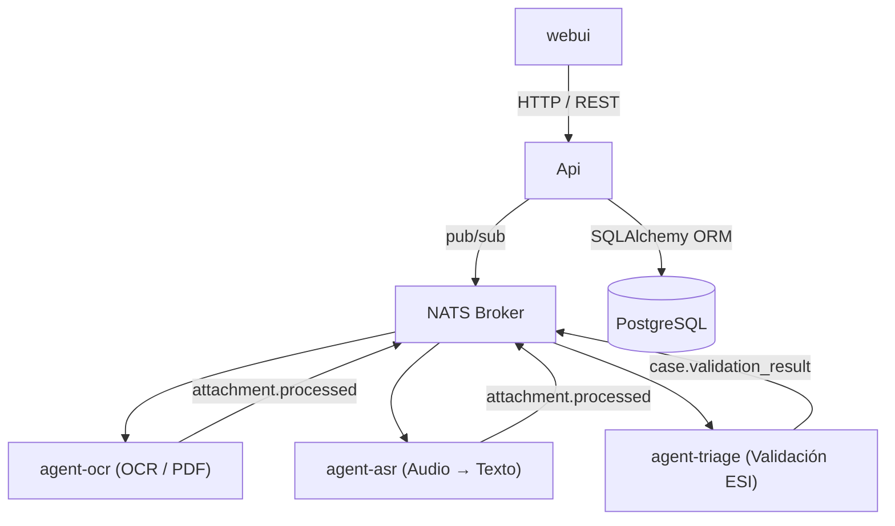

# UrgeNurse

AI-assisted triage platform for emergency healthcare settings. Processes patient documents and audio recordings using local LLMs to support nurses and doctors with documentation review and ESI triage level suggestions.

Everything runs locally in Docker — including the LLM (llama.cpp), so no cloud or external APIs are needed.

## Architecture



## Requirements

- [Docker Desktop](https://www.docker.com/products/docker-desktop/) ≥ 4.x (includes the `docker compose` plugin)
- 16 GB RAM recommended
- ~500 MB free disk for the model file

---

## 1 — Download the model

The `llm` service runs [llama.cpp](https://github.com/ggml-org/llama.cpp) and expects the quantised GGUF model at `code/models/lfm2-700m-q4_k_m.gguf`. The path is set by `LLAMA_ARG_MODEL` in `docker-compose.yml`.

Download [LiquidAI LFM2-700M](https://huggingface.co/LiquidAI/LFM2-700M-GGUF) (Q4_K_M, ~447 MB) into the `models/` directory:

```bash
cd code

# with curl
curl -L -o models/lfm2-700m-q4_k_m.gguf \
  https://huggingface.co/LiquidAI/LFM2-700M-GGUF/resolve/main/LFM2-700M-Q4_K_M.gguf

# or with the Hugging Face CLI
huggingface-cli download LiquidAI/LFM2-700M-GGUF LFM2-700M-Q4_K_M.gguf \
  --local-dir models --local-dir-use-symlinks False
mv models/LFM2-700M-Q4_K_M.gguf models/lfm2-700m-q4_k_m.gguf
```

Verify the file is in place:

```bash
ls -lh models/lfm2-700m-q4_k_m.gguf
```

---

## 2 — Install Docker

Install [Docker Desktop](https://www.docker.com/products/docker-desktop/) for your platform (macOS, Windows or Linux) and make sure it is running:

```bash
docker --version
docker compose version
```

---

## 3 — Configure environment

Copy the example env file and adjust values as needed:

```bash
cd code
cp .env.example .env
```

Key variables in `.env`:

| Variable            | Default             | Description                                       |
| ------------------- | ------------------- | ------------------------------------------------- |
| `POSTGRES_USER`     | `urgenurse`         | DB user                                           |
| `POSTGRES_PASSWORD` | `urgenurse`         | DB password — **change in production**            |
| `POSTGRES_DB`       | `urgenurse`         | DB name                                           |
| `JWT_SECRET`        | `change-me`         | Auth token secret — **change in production**      |
| `ADMIN_USER`        | `admin`             | Default admin username                            |
| `ADMIN_PASSWORD`    | `secret`            | Default admin password — **change in production** |
| `STORAGE_PATH`      | `/data/attachments` | File upload path                                  |

---

## 4 — Build and start the platform

From the `code/` directory:

```bash
docker compose build
docker compose up -d
```

The first build compiles llama.cpp from source, so it can take several minutes. Subsequent starts are fast.

Once the containers are up, the following endpoints are available:

| Service                   | URL                                |
| ------------------------- | ---------------------------------- |
| WebUI                     | http://localhost:3000              |
| API                       | http://localhost:8000              |
| API docs (Swagger UI)     | http://localhost:8000/docs         |
| API schema (OpenAPI JSON) | http://localhost:8000/openapi.json |
| LLM (llama.cpp)           | http://localhost:8080              |
| PostgreSQL                | localhost:5432                     |
| NATS                      | localhost:4222 (monitoring: :8222) |

Log in to the WebUI with the `ADMIN_USER` / `ADMIN_PASSWORD` credentials from `.env`.

---

## 5 — Run database migrations

On first start, apply migrations and seed the admin user:

```bash
docker compose exec api alembic upgrade head
docker compose exec api python seeders/seed.py
```

---

## Stopping

```bash
docker compose down
```

To also remove the database volume:

```bash
docker compose down -v
```

---

## Development

All agent and API source directories are mounted as volumes — changes are reflected immediately without rebuilding.

To restart a single service after a code change:

```bash
docker compose restart agent-ocr
docker compose restart agent-asr
docker compose restart agent-triage
docker compose restart api
```

To follow logs:

```bash
docker compose logs -f agent-triage
docker compose logs -f llm
```
